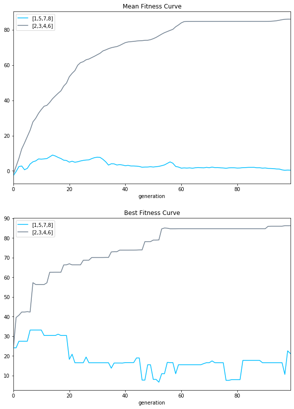
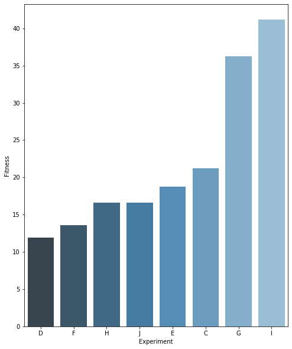

# Evoman - Artificial Intelligence Agent

This repository presents an intelligent agent trained using neuroevolution techniques to play the evoman game. Along with code, I have also prepared a short paper (written in Portuguese). However, I will summarize the main results below and give a brief introduction to the problem.

If you are interesting, you can read the project's short paper (Portuguese only) [here].(relatorio_final.pdf)
## Introduction

This projected aimed to train an agent to beat the highest number of enemies in the evoman game using AI. In order to accomplish that, we used neuroevolution, a famous technique that combines neural networks and evolutionary algorithms to opmitize neural net's weights. Results came from a varying range of experiments where we changed enemies which we trained the agent and the ones we tested, as well as varying model's hyperparameters such as number of generations, population size, and even network's parameters such as number of hidden neurons.

## Agent Environment (PEAS)

PEAS stands for Performance, Environment, Actuators e Sensors. This describes the kind of environment which our agent will play as well as parameters such as sensors, etc.

    Agent: Evoman
    Performance: Win the highest number of enemeries.
    Environment: Enemy and game stage.
    Action: Run forward, backaward, jump and shoot.
    Sensor: Distance from enemy and positon in the stage.

## Experiments

Like said previously, we did a different set of experiments to see how our agent was performing. Table 1 below gives all tests done during training phase.

<table style="height: 347px; width: 532px;">
<tbody>
<tr>
<td style="width: 61px; text-align: center;"><strong>E</strong></td>
<td style="width: 61px; text-align: center;"><strong>PS</strong></td>
<td style="width: 61px; text-align: center;"><strong>NG</strong></td>
<td style="width: 61px; text-align: center;"><strong>MR</strong></td>
<td style="width: 25px; text-align: center;"><strong>HN</strong></td>
<td style="width: 94.6px; text-align: center;"><strong>NE</strong></td>
<td style="width: 61.4px; text-align: center;"><strong>EE</strong></td>
</tr>
<tr>
<td style="width: 61px; text-align: center;">A</td>
<td style="width: 61px; text-align: center;">50</td>
<td style="width: 61px; text-align: center;">20</td>
<td style="width: 61px; text-align: center;">0.20</td>
<td style="width: 25px; text-align: center;">10</td>
<td style="width: 94.6px; text-align: center;">[1, 2, 4, 8]</td>
<td style="width: 61.4px; text-align: center;">No</td>
</tr>
<tr>
<td style="width: 61px; text-align: center;">B</td>
<td style="width: 61px; text-align: center;">50</td>
<td style="width: 61px; text-align: center;">20</td>
<td style="width: 61px; text-align: center;">0.20</td>
<td style="width: 25px; text-align: center;">10</td>
<td style="width: 94.6px; text-align: center;">[1, 3, 4, 8]</td>
<td style="width: 61.4px; text-align: center;">No</td>
</tr>
<tr>
<td style="width: 61px; text-align: center;">C</td>
<td style="width: 61px; text-align: center;">50</td>
<td style="width: 61px; text-align: center;">50</td>
<td style="width: 61px; text-align: center;">0.30</td>
<td style="width: 25px; text-align: center;">10</td>
<td style="width: 94.6px; text-align: center;">[1, 2, 4, 8]</td>
<td style="width: 61.4px; text-align: center;">No</td>
</tr>
<tr>
<td style="width: 61px; text-align: center;">D</td>
<td style="width: 61px; text-align: center;">50</td>
<td style="width: 61px; text-align: center;">50</td>
<td style="width: 61px; text-align: center;">0.20</td>
<td style="width: 25px; text-align: center;">10</td>
<td style="width: 94.6px; text-align: center;">[1, 3, 4, 8]</td>
<td style="width: 61.4px; text-align: center;">No</td>
</tr>
<tr>
<td style="width: 61px; text-align: center;">E</td>
<td style="width: 61px; text-align: center;">100</td>
<td style="width: 61px; text-align: center;">100</td>
<td style="width: 61px; text-align: center;">0.30</td>
<td style="width: 25px; text-align: center;">20</td>
<td style="width: 94.6px; text-align: center;">[1, 2, 4, 8]</td>
<td style="width: 61.4px; text-align: center;">Yes</td>
</tr>
<tr>
<td style="width: 61px; text-align: center;">F</td>
<td style="width: 61px; text-align: center;">100</td>
<td style="width: 61px; text-align: center;">100</td>
<td style="width: 61px; text-align: center;">0.30</td>
<td style="width: 25px; text-align: center;">20</td>
<td style="width: 94.6px; text-align: center;">[1, 2, 4, 8]</td>
<td style="width: 61.4px; text-align: center;">No</td>
</tr>
<tr>
<td style="width: 61px; text-align: center;">G</td>
<td style="width: 61px; text-align: center;">100</td>
<td style="width: 61px; text-align: center;">120</td>
<td style="width: 61px; text-align: center;">0.30</td>
<td style="width: 25px; text-align: center;">20</td>
<td style="width: 94.6px; text-align: center;">[1, 2, 4, 8]</td>
<td style="width: 61.4px; text-align: center;">Yes</td>
</tr>
<tr>
<td style="width: 61px; text-align: center;">H</td>
<td style="width: 61px; text-align: center;">100</td>
<td style="width: 61px; text-align: center;">100</td>
<td style="width: 61px; text-align: center;">0.30</td>
<td style="width: 25px; text-align: center;">20</td>
<td style="width: 94.6px; text-align: center;">[1, 5, 7, 8]</td>
<td style="width: 61.4px; text-align: center;">No</td>
</tr>
<tr>
<td style="width: 61px; text-align: center;">I</td>
<td style="width: 61px; text-align: center;">100</td>
<td style="width: 61px; text-align: center;">100</td>
<td style="width: 61px; text-align: center;">0.30</td>
<td style="width: 25px; text-align: center;">20</td>
<td style="width: 94.6px; text-align: center;">[2, 3, 4, 6]</td>
<td style="width: 61.4px; text-align: center;">No</td>
</tr>
<tr>
<td style="width: 61px; text-align: center;">J</td>
<td style="width: 61px; text-align: center;">100</td>
<td style="width: 61px; text-align: center;">100</td>
<td style="width: 61px; text-align: center;">0.30</td>
<td style="width: 25px; text-align: center;">20</td>
<td style="width: 94.6px; text-align: center;">[1, 3, 4, 5, 8]</td>
<td style="width: 61.4px; text-align: center;">No</td>
</tr>
</tbody>
</table>

    E: Experiment Name
    PS: Population Size
    NG: Number of Generations
    MR: Mutation Rate
    HN: Number of Hidden Neurons
    EL: Enemy List
    EE: Evolutonary Strategy

To give a brief theoretical foundation, our agent was trained using a simple neural network, with only one hidden layer, and five outputs indicating one for doing the action, or zero for not doing it. From the NN, we tried different numbers of hidden neurons. To learn the optimal weights, since we did not have a dataset to train our nwtwork, we used Genetic Algorithms to accomplish the task. Here, we modified parameters such as mutation rate, population size, number of generations and if it applied evolutionary strategy or not (Crossover point). From environment parameters, we also tried our agent with different set of enemeries trained versus the ones we tested our results.

## Result Analysis

Our biggest objective was to kill the highest number of enemies. However, we have a fitness function calculated based on the enemy life, player life and time spent on the stage. Then, an average is calculated with all trained and tested enemies.

### Fitness Values

The plot below we calculated the fitness values for each generation with training enemies.

A few interesting notes:
 - Experiments which use Evolutionary Strategies have smoother lines than other ones. Since they use crossover based on real and continuous values, they tend not to repeat local minumums.
 - Since we did not implemented elitist strategy, not always the best individual remains to the next generation. as happened in experiment E.
 - Standard Deviation practically vanishes when coming to the last generations. This is totally expected since in GA we have a trade-off between exploration versus exploitation, and when generation advances, the population becomes more specialized.
 - Mean fitness always increases, indicating a convergence to some minimum to the problem.
 - Experiment G has the biggest number of generations, and likely did not find a local minimum. We might have a better solution if persisting on next generations. 
 - H and I have same set of parameters, but different enemies. We can see the difference of choosing enemies on this problem.

 ### Overfitting Curve

 Since we are training our agent using 4 stages only and tested on other 4 ones, we can calculate how much we are overfitting. To do that, we used stages [2, 3, 5, 6] to optmize network's weights, and tested with stages [1, 5, 7, 8]. The plot below shows two curves, training and "validation", for mean and best fitness, respectively. 

 

 It is not so clear as when training with supervised learning, but I think we can infer a validation/training strategy here where we achieve a minimum in validation and then with overfitting, validation accuracy decreases again.

### Best Solutions

To finish, we will analyze results regarding our main task: kill the highest number of enemies. All experiments were tested with other 4 enemies (the ones not used to train). The barplot below summarizes the results for each experiment.

 

Moreover, we collected information for final player life, enemy life, time and number of enemies dead. Table 2 shows that information.

<table style="height: 272px; width: 371.6px;">
<tbody>
<tr>
<td style="width: 59px; text-align: center;"><strong>Exp.</strong></td>
<td style="width: 59px; text-align: center;"><strong>Player Life</strong></td>
<td style="width: 59px; text-align: center;">

<strong>Enemy Life</strong>

</td>
<td style="width: 59px; text-align: center;"><strong>Time</strong></td>
<td style="width: 105.6px; text-align: center;"><strong>N of enemies dead</strong></td>
</tr>
<tr>
<td style="width: 59px; text-align: center;">C</td>
<td style="width: 59px; text-align: center;">-5.76</td>
<td style="width: 59px; text-align: center;">26.92</td>
<td style="width: 59px; text-align: center;">191.56</td>
<td style="width: 105.6px; text-align: center;">1</td>
</tr>
<tr>
<td style="width: 59px; text-align: center;">D</td>
<td style="width: 59px; text-align: center;">-15.51</td>
<td style="width: 59px; text-align: center;">6.35</td>
<td style="width: 59px; text-align: center;">131.63</td>
<td style="width: 105.6px; text-align: center;">1</td>
</tr>
<tr>
<td style="width: 59px; text-align: center;">E</td>
<td style="width: 59px; text-align: center;">-12.28</td>
<td style="width: 59px; text-align: center;">8.29</td>
<td style="width: 59px; text-align: center;">132.28</td>
<td style="width: 105.6px; text-align: center;">2</td>
</tr>
<tr>
<td style="width: 59px; text-align: center;">F</td>
<td style="width: 59px; text-align: center;">-11.28</td>
<td style="width: 59px; text-align: center;">-2.8</td>
<td style="width: 59px; text-align: center;">152.17</td>
<td style="width: 105.6px; text-align: center;">3</td>
</tr>
<tr>
<td style="width: 59px; text-align: center;">G</td>
<td style="width: 59px; text-align: center;">-3.62</td>
<td style="width: 59px; text-align: center;">-3.72</td>
<td style="width: 59px; text-align: center;">245.54</td>
<td style="width: 105.6px; text-align: center;">2</td>
</tr>
<tr>
<td style="width: 59px; text-align: center;">H</td>
<td style="width: 59px; text-align: center;">-4.89</td>
<td style="width: 59px; text-align: center;">-3.10</td>
<td style="width: 59px; text-align: center;">195.82</td>
<td style="width: 105.6px; text-align: center;">4</td>
</tr>
<tr>
<td style="width: 59px; text-align: center;">I</td>
<td style="width: 59px; text-align: center;">-4.36</td>
<td style="width: 59px; text-align: center;">-5.87</td>
<td style="width: 59px; text-align: center;">285</td>
<td style="width: 105.6px; text-align: center;">3</td>
</tr>
<tr>
<td style="width: 59px; text-align: center;">J</td>
<td style="width: 59px; text-align: center;">-7.24</td>
<td style="width: 59px; text-align: center;">-3.73</td>
<td style="width: 59px; text-align: center;">164.39</td>
<td style="width: 105.6px; text-align: center;">3</td>
</tr>
</tbody>
</table>

Here it is interesting to note that experiment H killed most enemies, however best fitness was from experiment I. This illustrates well how choosing a model will depend highly on the problem to be solved.

