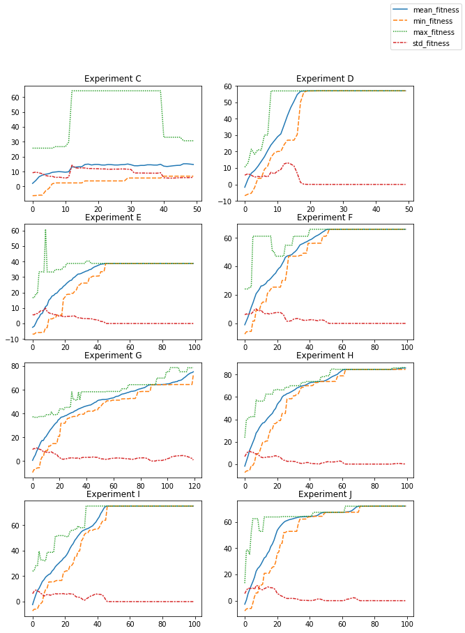

# Evoman - Artificial Intelligence Agent

This repository presents an intelligent agent trained using neuroevolution techniques to play the evoman game. Along with code, I have also prepared a short paper (written in Portuguese), however, I will summarize the main results below and give a brief introduction to the problem.

## Introduction

This projected aimed to train an agent to beat the highest number of enemies in the evoman game using AI. In order to accomplish that, we used neuroevolution, a famous technique that combines neural networks and evolutionary algorithms to opmitize neural net's weights. Results came from a varying range of experiments where we changed enemies which we trained the agent and the ones we tested, as well as varying model's hyperparameters such as number of generations, population size, and even network's parameters such as number of hidden neurons.

## Agent Environment (PEAS)

PEAS stands for Performance, Environment, Actuators e Sensors. This describes the kind of environment which our agent will play as well as parameters such as sensors, etc.

    Agent: Evoman
    Performance: Win the highest number of enemeries.
    Environment: Enemy and game stage.
    Action: Run forward, backaward, jump and shoot.
    Sensor: Distance from enemy and positon in the stage.

## Experiments

Like said previously, we did a different set of experiments to see how our agent was performing. Table 1 below gives all tests done during training phase.

<table style="height: 347px; width: 532px;">
<tbody>
<tr>
<td style="width: 61px; text-align: center;"><strong>E</strong></td>
<td style="width: 61px; text-align: center;"><strong>PS</strong></td>
<td style="width: 61px; text-align: center;"><strong>NG</strong></td>
<td style="width: 61px; text-align: center;"><strong>MR</strong></td>
<td style="width: 25px; text-align: center;"><strong>HN</strong></td>
<td style="width: 94.6px; text-align: center;"><strong>NE</strong></td>
<td style="width: 61.4px; text-align: center;"><strong>EE</strong></td>
</tr>
<tr>
<td style="width: 61px; text-align: center;">A</td>
<td style="width: 61px; text-align: center;">50</td>
<td style="width: 61px; text-align: center;">20</td>
<td style="width: 61px; text-align: center;">0.20</td>
<td style="width: 25px; text-align: center;">10</td>
<td style="width: 94.6px; text-align: center;">[1, 2, 4, 8]</td>
<td style="width: 61.4px; text-align: center;">No</td>
</tr>
<tr>
<td style="width: 61px; text-align: center;">B</td>
<td style="width: 61px; text-align: center;">50</td>
<td style="width: 61px; text-align: center;">20</td>
<td style="width: 61px; text-align: center;">0.20</td>
<td style="width: 25px; text-align: center;">10</td>
<td style="width: 94.6px; text-align: center;">[1, 3, 4, 8]</td>
<td style="width: 61.4px; text-align: center;">No</td>
</tr>
<tr>
<td style="width: 61px; text-align: center;">C</td>
<td style="width: 61px; text-align: center;">50</td>
<td style="width: 61px; text-align: center;">50</td>
<td style="width: 61px; text-align: center;">0.30</td>
<td style="width: 25px; text-align: center;">10</td>
<td style="width: 94.6px; text-align: center;">[1, 2, 4, 8]</td>
<td style="width: 61.4px; text-align: center;">No</td>
</tr>
<tr>
<td style="width: 61px; text-align: center;">D</td>
<td style="width: 61px; text-align: center;">50</td>
<td style="width: 61px; text-align: center;">50</td>
<td style="width: 61px; text-align: center;">0.20</td>
<td style="width: 25px; text-align: center;">10</td>
<td style="width: 94.6px; text-align: center;">[1, 3, 4, 8]</td>
<td style="width: 61.4px; text-align: center;">No</td>
</tr>
<tr>
<td style="width: 61px; text-align: center;">E</td>
<td style="width: 61px; text-align: center;">100</td>
<td style="width: 61px; text-align: center;">100</td>
<td style="width: 61px; text-align: center;">0.30</td>
<td style="width: 25px; text-align: center;">20</td>
<td style="width: 94.6px; text-align: center;">[1, 2, 4, 8]</td>
<td style="width: 61.4px; text-align: center;">Yes</td>
</tr>
<tr>
<td style="width: 61px; text-align: center;">F</td>
<td style="width: 61px; text-align: center;">100</td>
<td style="width: 61px; text-align: center;">100</td>
<td style="width: 61px; text-align: center;">0.30</td>
<td style="width: 25px; text-align: center;">20</td>
<td style="width: 94.6px; text-align: center;">[1, 2, 4, 8]</td>
<td style="width: 61.4px; text-align: center;">No</td>
</tr>
<tr>
<td style="width: 61px; text-align: center;">G</td>
<td style="width: 61px; text-align: center;">100</td>
<td style="width: 61px; text-align: center;">120</td>
<td style="width: 61px; text-align: center;">0.30</td>
<td style="width: 25px; text-align: center;">20</td>
<td style="width: 94.6px; text-align: center;">[1, 2, 4, 8]</td>
<td style="width: 61.4px; text-align: center;">Yes</td>
</tr>
<tr>
<td style="width: 61px; text-align: center;">H</td>
<td style="width: 61px; text-align: center;">100</td>
<td style="width: 61px; text-align: center;">100</td>
<td style="width: 61px; text-align: center;">0.30</td>
<td style="width: 25px; text-align: center;">20</td>
<td style="width: 94.6px; text-align: center;">[1, 5, 7, 8]</td>
<td style="width: 61.4px; text-align: center;">No</td>
</tr>
<tr>
<td style="width: 61px; text-align: center;">I</td>
<td style="width: 61px; text-align: center;">100</td>
<td style="width: 61px; text-align: center;">100</td>
<td style="width: 61px; text-align: center;">0.30</td>
<td style="width: 25px; text-align: center;">20</td>
<td style="width: 94.6px; text-align: center;">[2, 3, 4, 6]</td>
<td style="width: 61.4px; text-align: center;">No</td>
</tr>
<tr>
<td style="width: 61px; text-align: center;">J</td>
<td style="width: 61px; text-align: center;">100</td>
<td style="width: 61px; text-align: center;">100</td>
<td style="width: 61px; text-align: center;">0.30</td>
<td style="width: 25px; text-align: center;">20</td>
<td style="width: 94.6px; text-align: center;">[1, 3, 4, 5, 8]</td>
<td style="width: 61.4px; text-align: center;">No</td>
</tr>
</tbody>
</table>

    E: Experiment Name
    PS: Population Size
    NG: Number of Generations
    MR: Mutation Rate
    HN: Number of Hidden Neurons
    EL: Enemy List
    EE: Evolutonary Strategy

To give a brief theoretical foundation, our agent was trained using a simple neural network, with only one hidden layer, and five outputs indicating one for doing the action, or zero for not doing it. From the NN, we tried different numbers of hidden neurons. To learn the optimal weights, since we did not have a dataset to train our nwtwork, we used Genetic Algorithms to accomplish the task. Here, we modified parameters such as mutation rate, population size, number of generations and if it applied evolutionary strategy or not (Crossover point). From environment parameters, we also tried our agent with different set of enemeries trained versus the ones we tested our results.

## Result Analysis

Our biggest objective was to kill the highest number of enemies. However, we have a fitness function calculated based on the enemy life, player life and time spent on the stage. Then, an average is calculated with all trained and tested enemies.

The plot below we calculated the fitness values for each generation with training enemies.

